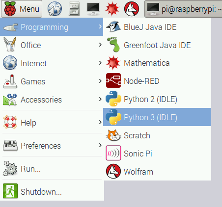

# Getting Started with Picamera

The camera module is a great accessory for the Raspberry Pi, allowing users to take still pictures and record video in full HD from their Raspberry Pi.

## Connect the camera module

First of all, with the Pi switched off, you'll need to connect the camera module to the Raspberry Pi's camera port, then boot the Pi and ensure the software is enabled.

1. Locate the camera port:

    

1. Connect the camera:

    

1. Boot the Pi

1. Open the **Raspberry Pi Configuration Tool** from the main menu:

    

1. Ensure the camera software is enabled:

    

    If it's not enabled, enable it and reboot your Pi to begin.

## Camera preview

Now your camera is connected and the software is enabled, you can get started by trying out the camera preview.

1. Open **Python 3** from the main menu:

    

1. Open a new file and save it as `camera.py` (important: **do not** save as `picamera.py`).

1. Enter the following code:

    ```python
    from picamera import PiCamera
    from time import sleep

    camera = PiCamera()

    camera.start_preview()
    sleep(10)
    camera.stop_preview()
    ```

1. Save with **Ctrl + S** and run with **F5**. The camera preview should be shown for 10 seconds, and then close. Move the camera around to preview what the camera sees.

## Still pictures

The most basic use for the camera module is taking still pictures - but it's also the most common use.

1. Amend your code to reduce the `sleep` and add a `camera.capture()` line:

    ```python
    camera.start_preview()
    sleep(5)
    camera.capture('/home/pi/Desktop/image.jpg')
    camera.stop_preview()
    ```

1. Run the code and you'll see the camera preview open up for 5 seconds before capturing a still picture. You'll see the preview adjust to a different resolution momentarily as the picture is taken.

1. You'll see your photo on the Desktop - double click the file icon to open it.

1. Now try adding a loop to take 5 pictures in a row:

    ```python
    camera.start_preview()
    for i in range(5):
        sleep(5)
        camera.capture('/home/pi/Desktop/image%s.jpg' % i)
    camera.stop_preview()
    ```

    *The variable `i` contains the current iteration number, from `0` to `4`, so the images will be saved as `image0.jpg`, `image1.jpg` and so on*

1. Run the code again and hold the camera in position. It will take one picture every 5 seconds.

1. Once the fifth picture is taken, the preview will close. Now look at the images on your Desktop and you'll see 5 new pictures.

## Recording video

Now you've used the camera to take still pictures, you can move on to recording video.

1. Amend your code to replace `capture()` with `start_preview()` and `stop_preview()`:

    ```python
    camera.start_preview()
    camera.start_recording('/home/pi/video.h264')
    sleep(10)
    camera.stop_recording()
    camera.stop_preview()
    ```

1. Run the code and it will record 10 seconds of video and then close the preview.

1. Now, to play the video, you'll need to open a Terminal window by clicking the black monitor icon in the taskbar:

    

1. Type the following command, and press Enter, to play the video:

    ```bash
    omxplayer video.h264
    ```

1. The video should play for 10 seconds.

## Effects

At the beginning, you created a `camera` object with `camera = PiCamera()`. You can manipulate this `camera` object in order to configure its settings. The camera software provides a number of effects and other configurations you can apply. Some only apply to the preview and now the capture, others vise-versa, but many affect both.

1. The resolution of the capture is configurable. By default it is set to X x Y, but the maximum resolution is X x Y. Try the following example to set the resolution to max:

    ```python
    camera.resolution = (X, Y)
    camera.start_preview()
    sleep(5)
    camera.capture('/home/pi/Desktop/max.jpg')
    camera.stop_preview()
    ```

1. ...

## What next?

Now you've got started with the camera module, what else can you do? You could try adding GPIO controls using [GPIO Zero](https://gpiozero.readthedocs.org/) or integrate with Minecraft Pi or even post your pictures to Twitter! Try some more camera resources:

- [Push Button Stop Motion](https://www.raspberrypi.org/learning/push-button-stop-motion/)
- [Minecraft Photobooth](https://www.raspberrypi.org/learning/minecraft-photobooth/)
- [Tweeting Babbage](https://www.raspberrypi.org/learning/tweeting-babbage/)
- [Parent Detector](https://www.raspberrypi.org/learning/parent-detector/)

Also see the extensive [picamera documentation](https://picamera.readthedocs.org/) for more information.
